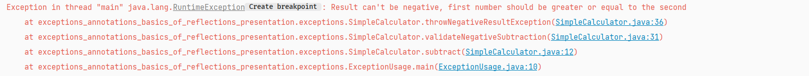
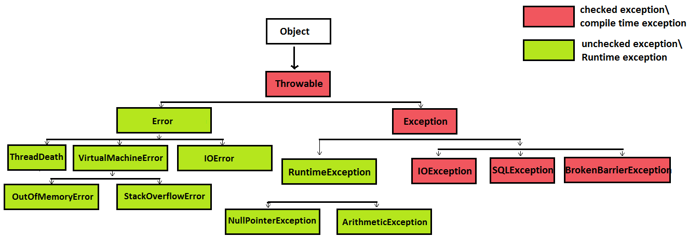

Exceptions
-
**Exception** => event that occurs during the execution of a program and breaks the normal process of its operation
After an exception is thrown, the thread running the process is terminated and the java runtime tries to find a 
piece of code that can handle it (try catch block).
The set of possible elements for handling an exception is an ordered list of methods that were called to get to the
method where the error occurred. The method list is known as a stacktrace.
Each method run in java is saved on what is called Stacktrace, since it is a stack, the most recent method call 
is the first method to be checked and popped from the stack.

--------------------------------
Each exception extends the Throwable class which gives exceptions a special feature, it allows them to be thrown
using the keyword *throw*

---------------------------------
We can define our own custom exceptions by extending one of the exception classes.
In other words we can either extend the most upper class which is Throwable (not recommended).
Or we can extend one of the subtypes Exception, java.RuntimeException or any other subtype
but these two are the most common.

